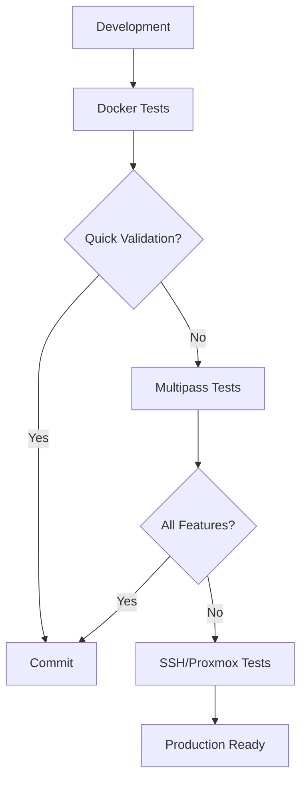

# Real LXC Testing Guide

## 🎯 **Overview**

While Docker testing covers **85%** of functionality (CLI, parsing, logic), **real LXC testing** provides **100%** coverage including actual container operations, networking, and system integration.

## 🌐 **Method 1: SSH to Proxmox Host (Recommended)**

### Prerequisites
- Access to Proxmox VE host or LXC-enabled Linux server
- SSH access with root privileges
- Network connectivity to the host

### Quick Setup
```bash
# Run the interactive SSH tester
./integration-test/ssh-runner/enhanced-ssh-test.sh

# Or manual setup:
ssh root@your-proxmox-host
cd /tmp
git clone <your-repo-url> lxc-compose-test
cd lxc-compose-test
```

### Benefits
- ✅ **100% real environment** - Actual Proxmox/LXC
- ✅ **Production accuracy** - Same environment as deployment
- ✅ **Full networking** - Real bridges, VLANs, firewalls
- ✅ **Storage testing** - Real ZFS, LVM, directories
- ⚠️ **Requires access** - Need existing Proxmox host

---

## 🖥️ **Method 2: Multipass VMs (Clean Environment)**

### Prerequisites
```bash
# Install Multipass
# Ubuntu/Debian:
sudo snap install multipass

# macOS:
brew install --cask multipass

# Windows:
# Download from https://multipass.run/
```

### Setup Process
```bash
# Run automated setup
./integration-test/multipass/setup-multipass-test.sh

# Or manual:
multipass launch 22.04 --name lxc-test --cpus 2 --mem 4G --disk 20G
multipass shell lxc-test
sudo apt update && sudo apt install -y lxd golang-go git
```

### Benefits
- ✅ **Clean Ubuntu environment** - No conflicting software
- ✅ **LXD/LXC native support** - Ubuntu's official containers
- ✅ **Isolated testing** - Won't affect host system
- ✅ **Easy cleanup** - `multipass delete lxc-test`
- ⚠️ **VM overhead** - Requires virtualization

---

## 📱 **Method 3: Vagrant VMs (Traditional)**

### Prerequisites
```bash
# Install Vagrant and VirtualBox
# Ubuntu:
sudo apt install vagrant virtualbox

# macOS:
brew install --cask vagrant virtualbox

# Windows:
# Download from vagrantup.com and virtualbox.org
```

### Setup Process
```bash
cd integration-test/vagrant
vagrant up
vagrant ssh

# Inside VM:
cd /vagrant
./test-in-vm.sh
```

### Benefits
- ✅ **Traditional VMs** - Works with any hypervisor
- ✅ **Reproducible** - Exact same environment every time
- ✅ **Version control** - Vagrantfile in git
- ✅ **Multi-provider** - VirtualBox, VMware, etc.
- ⚠️ **Slower startup** - Full VM boot required

---

## 🐧 **Method 4: Native Linux Installation**

### Prerequisites
- Ubuntu 20.04+ or similar Linux distribution
- Root access or sudo privileges
- LXC/LXD not already configured

### Setup Process
```bash
# Install LXC/LXD
sudo apt update
sudo apt install -y lxd golang-go git

# Initialize LXD
sudo lxd init --auto

# Add user to lxd group
sudo usermod -a -G lxd $USER
newgrp lxd

# Clone and test
git clone <your-repo> lxc-compose-test
cd lxc-compose-test
go build -o lxc-compose ./cmd/lxc-compose/
```

### Benefits
- ✅ **Native performance** - No virtualization overhead
- ✅ **Full LXD features** - Clustering, networking, storage
- ✅ **Development environment** - Use as daily driver
- ⚠️ **System changes** - Modifies host LXC configuration

---

## 🧪 **Comprehensive Test Scenarios**

### 1. **Basic Container Operations**
```bash
# Test basic lifecycle
sudo ./lxc-compose up web
sudo lxc list
sudo ./lxc-compose ps
sudo ./lxc-compose logs web
sudo ./lxc-compose down web
```

### 2. **Networking Tests**
```bash
# Test network isolation
sudo ./lxc-compose up web db
sudo lxc exec web -- ping db
sudo lxc exec web -- curl http://db:5432

# Test port mapping
curl http://localhost:8080  # Should reach container
```

### 3. **Volume Mounting**
```bash
# Test bind mounts
echo "test data" > /tmp/test.txt
sudo ./lxc-compose up -v /tmp:/mnt web
sudo lxc exec web -- cat /mnt/test.txt
```

### 4. **Template Testing**
```bash
# Test OCI image conversion
sudo ./lxc-compose convert alpine:latest
sudo ./lxc-compose images
```

### 5. **Error Scenarios**
```bash
# Test resource constraints
sudo ./lxc-compose up --memory 128M web  # Should fail if too low
sudo ./lxc-compose up --storage 1G web   # Test storage limits
```

### 6. **Performance Testing**
```bash
# Test concurrent operations
for i in {1..5}; do
    sudo ./lxc-compose up web-$i &
done
wait

# Monitor resources
sudo lxc list
sudo lxc info --resources
```

---

## 📊 **Testing Matrix**

| Test Scenario | Docker | SSH/Proxmox | Multipass | Vagrant | Native |
|---------------|---------|-------------|-----------|---------|---------|
| **CLI Testing** | ✅ | ✅ | ✅ | ✅ | ✅ |
| **Config Parsing** | ✅ | ✅ | ✅ | ✅ | ✅ |
| **Error Handling** | ✅ | ✅ | ✅ | ✅ | ✅ |
| **Container Creation** | ❌ | ✅ | ✅ | ✅ | ✅ |
| **Networking** | ❌ | ✅ | ✅ | ✅ | ✅ |
| **Volume Mounts** | ❌ | ✅ | ✅ | ✅ | ✅ |
| **Template Ops** | ❌ | ✅ | ✅ | ✅ | ✅ |
| **Performance** | ❌ | ✅ | ✅ | ✅ | ✅ |
| **Production Reality** | ❌ | ✅ | ⚠️ | ⚠️ | ⚠️ |

## 🚀 **CI/CD Integration**

### GitHub Actions Example
```yaml
name: LXC Integration Tests
on: [push, pull_request]

jobs:
  docker-tests:
    runs-on: ubuntu-latest
    steps:
      - uses: actions/checkout@v4
      - name: Run Docker tests
        run: ./integration-test/quick-test.sh 1

  multipass-tests:
    runs-on: ubuntu-latest
    steps:
      - uses: actions/checkout@v4
      - name: Install Multipass
        run: sudo snap install multipass
      - name: Run Multipass tests
        run: ./integration-test/multipass/setup-multipass-test.sh
```

## 💡 **Recommendations**

### **For Development**
1. **Docker** - Fast iteration, basic validation
2. **Multipass** - Real LXC testing when needed

### **For CI/CD**
1. **Docker** - Unit tests, CLI validation, configuration parsing
2. **Native Linux** - Integration tests on GitHub Actions runners

### **For Production Validation**
1. **SSH to Proxmox** - Exact production environment
2. **Performance testing** - Real hardware constraints

### **For Debugging**
1. **Native Linux** - Direct access to logs and debugging tools
2. **Vagrant** - Reproducible bug environments

## 🔧 **Troubleshooting**

### Common Issues

**LXC bridge not working in Docker:**
- Expected - use real environments for networking tests

**Permission denied in containers:**
- Use `sudo` for LXC operations
- Check user group membership (`lxd` group)

**Template not found:**
- Verify LXD image server connectivity
- Check proxy settings in corporate environments

**Network conflicts:**
- LXD uses 10.x.x.x by default
- Configure different subnets if conflicts occur

---

## 📈 **Testing Strategy**



Use this multi-layered approach for comprehensive validation:
1. **Docker** - Every commit (fast feedback)
2. **Multipass** - Feature completion (thorough testing)
3. **SSH/Proxmox** - Release validation (production accuracy) 